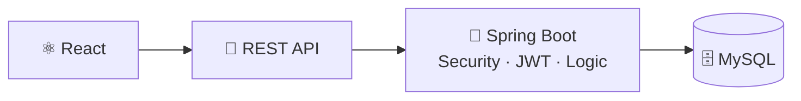
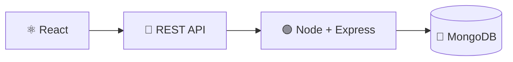
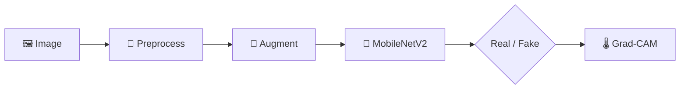
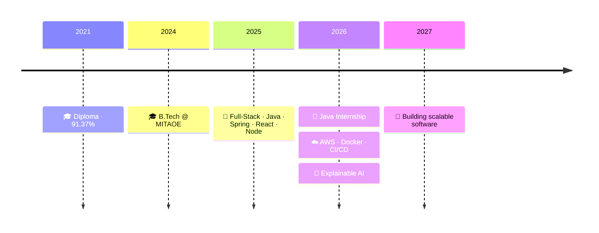

<!-- ═══════════════ HEADER ═══════════════ -->

 

 

<!-- ═══════════════ ABOUT ═══════════════ -->

> **B.Tech Computer Engineering student** building secure, scalable & practical software.
> Currently **Java Full-Stack Intern** @ SK Bit Software Solutions — REST APIs, MySQL, debugging, Agile & Git.

 

<!-- ═══════════════ SKILLS ═══════════════ -->

| | |
|:--|:--|
| **☕ Backend** | `Java` `Spring Boot` `Spring Security` `REST APIs` `JWT` `RBAC` `MySQL` |
| **🌐 Full-Stack** | `React.js` `Node.js` `Express.js` `JavaScript` `HTML/CSS` `MongoDB` `Firebase` |
| **☁️ Cloud & DevOps** | `AWS EC2` `S3` `IAM` `Docker` `Git` `GitHub Actions` `CI/CD` `Vercel` `Render` |
| **🤖 AI / CV** | `Python` `TensorFlow` `MobileNetV2` `OpenCV` `Grad-CAM` `Transfer Learning` |

 

 

<!-- ═══════════════ PROJECTS ═══════════════ -->

<table>
<tr>
<td width="33%" valign="top">

### 🐾 Home4Pet
*Pet Adoption Platform*

`React` `Spring Boot` `MySQL` `Docker`

- 🔐 JWT + Spring Security
- 👥 Adopter / Lister / Admin roles
- 📩 Adoption request workflow
- 💳 Stripe Checkout
- 🤖 Groq AI chatbot
- 🐳 Dockerized full stack

</td>
<td width="33%" valign="top">

### 🛠️ Service Sphere
*Service Booking Marketplace*

`React` `Node` `Express` `MongoDB`

- 🔐 JWT auth, 3 roles
- 📅 Booking + history
- ⭐ Customer feedback
- 🧪 APIs tested in Postman
- 🌍 Vercel + Render deploy

</td>
<td width="33%" valign="top">

### 🤖 Deepfake Detector
*Explainable Deep Learning*

`TensorFlow` `MobileNetV2` `OpenCV`

- 🎯 **92%** accuracy
- 🧠 Transfer learning
- 🔄 Data augmentation
- 🌡️ Grad-CAM heatmaps
- 📄 Research paper → ICCSTS

</td>
</tr>
</table>

<b>🏗️ View Architectures</b>

 

 

<!-- ═══════════════ EXPERIENCE + ACHIEVEMENTS ═══════════════ -->

<table>
<tr>
<td width="50%" valign="top">

**💼 Java Full-Stack Intern**
`SK Bit Software Solutions` · *Jul 2026 – Present*

- Built backend modules & Spring Boot REST APIs
- MySQL integration & business logic
- Debugging, testing, optimization
- Code reviews · Git · Agile
- Deployment & maintenance

</td>
<td width="50%" valign="top">

- 🥇 **Top 10 / 500+** — Zensar recruitment (6 rounds)
- 🤖 **ET AI Hackathon 2.0** — AI solution recognition
- 📄 **Research paper** — Explainable deepfake detection (MobileNetV2 + FFT + Grad-CAM), submitted to ICCSTS
- 📹 **Inter-college hackathon** — Docker-based secure WSL IP-camera streaming

</td>
</tr>
</table>

 

<!-- ═══════════════ EDU + CERTS ═══════════════ -->

| 🎓 Education | Years | Score |
|:--|:-:|:-:|
| **B.Tech Computer Engineering** — MIT Academy of Engineering, Pune | 2024–27 | **8.26 CGPA** |
| **Diploma Computer Engineering** — Govt. Polytechnic, Latur | 2021–24 | **91.37%** |

| 📜 Certification | Status |
|:--|:-:|
| ☁️ AWS Certified Cloud Practitioner | ✅ |
| 🧪 Software Testing — NPTEL | ⭐ Elite |
| 📘 TCS iON Career Edge | ✅ |

 

<!-- ═══════════════ ROADMAP ═══════════════ -->

 

<!-- ═══════════════ STATS ═══════════════ -->

 

<!-- ═══════════════ FOOTER ═══════════════ -->

### 🎯 Open to: `Java Dev` · `Backend` · `Full-Stack` · `Cloud` · `AI/ML`

